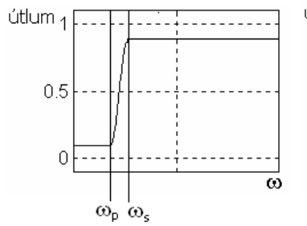
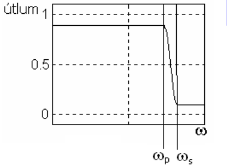
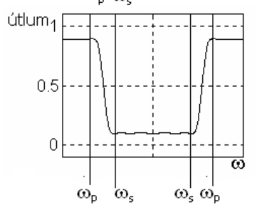
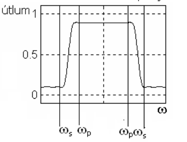

# Digitální filtrace

## Zesílení a útlum
- Zesílení
  - Proces zvětšení amplitudy signálu (napěťové, proudové, atd.)
  - Udáváno buď bezrozměrně nebo v dB
- Útlum
  - Útlum vyjadřuje míru ztráty signálu (v dB) při jeho šíření médii, např. kabelem nebo vzduchem
- dB
  - Původně útlumu telefonního vedení, akustika
  - Logaritmická stupnice , umožňuje to snadnější práci s velmi velkými nebo malými čísly.

## LTI systémy
- Lineární časově invariantní systémy : Systém je lineární, pokud splňuje princip superpozice, což znamená, že odpověď na lineární kombinaci vstupů je rovna stejné lineární kombinaci odpovědí na tyto vstupy.
- Časová invariantost: Systém je časově invariantní, pokud posunutí vstupního signálu v čase způsobí stejný posun v odpovědi systému.  
- Předpoklady
  - Kauzalita: Systém je kauzální, pokud jeho výstup v jakémkoli časovém okamžiku závisí pouze na hodnotách vstupu do tohoto okamžiku nebo dříve. (Nezávisí na budoucích)
  - Stabilita: Systém je stabilní, pokud je výstup systému omezen pro každý omezený vstup.
- Impulzní odezva: je odezva systému na Diracovu delta funkci

## Konvoluce
Jednoduše řečeno, konvoluce je proces, při kterém se kombinuje jeden signál s jiným, aby se vytvořil třetí signál.

### Vlastnosti
Komutativnost: Pořadí vstupů neovlivní výstup  
Asociativnost: Možnost seskupení více konvolucí bez změny výsledku  
Distibutivnost: Možnost roznásobení jednoho čísla součtem nebo rozdílem dvou dalších čísel

## Fourierova transformace
- Základním matematickým aparátem pro převod z časové oblasti do frekvenční je Fourierova transformace

## Artefakty
- Část záznamu (biosignálu či obrazového signálu), která nemá fyziologický původ ve vyšetřovaném orgánu
- technické artefakty - především při zpracování bioelektrických signálů (elektrická síť)
- Biologické artefakty - Pohybové artefakty, vzájemným vlivem různých orgánů

## Filtrace
- Filtrace = rozdělení signálu na základě jeho frekvenčních složek na propustné a nepropustné pásmo
- Systém implementující funkci filtrace se nazývá filtr
- Za jistých podmínek je filtrace procesem, která propouští dané frekvenční pásmo s minimálními deformacemi

## Typy filtrů
- Podle funkce (pozor tady v těch fotkách se jedná o útlum takže jsou tam znázorněné frekvence které jsou odfiltrované)
  - dolní propust (DP)  
    -   
  - horní propust (HP)   
    - 
  - pásmová propust (PP)  
    - 
  - pásmová zádrž (PZ)  
    - 

### Podle impulsové odezvy

#### Filtry typu IIR
- Filtry typu IIR (Infinite Impulse Response) jsou digitální filtry s nekonečnou impulsní odezvou.
- Fáze: Tyto filtry nemají lineární fázi, což může vést ke změnám ve tvaru signálu při průchodu filtrem
- Skupinové zpoždění: Není konzistentní pro všechny frekvenční složky, což může způsobit fázové zkreslení.
- Podmínky pro stabilitu filtrů zahrnují, že všechny póly systému musí ležet uvnitř jednotkové kružnice v z-rovině.

#### Filtry typu FIR
- Filtry typu FIR (Finite Impulse Response) jsou digitální filtry s konečnou impulsní odezvou.
- Fáze: Filtry typu FIR mohou dosáhnout lineární fáze, což znamená konstantní skupinové zpoždění pro všechny frekvenční složky, což je klíčové pro aplikace, kde je důležitá přesnost fázové charakteristiky signálu.
- Stabilita: FIR filtry jsou vždy stabilní, což je zásadní výhoda oproti IIR filtrům.

#### Souhrn pro FIR a IIR filtry

### Podle typu zpracování
- analogové filtry (odpor, kondenzátor, cívka)
- číslicové filtry (signálové procesory, PC)

## Adaptivní filtrace
- Potřeba reagovat na změny rušení
- Adaptace
  - Nejčastěji LMS (Least Mean Square) algoritmus
  - Lineární filtr
  - V praxi většinou lineární filtr typu FIR (možno ale i IIR)

## Adaptivní filtrace - LMS
- Gradientní prohledávání
  - Důležitý je vztah mezi chybovým signálem a koeficienty filtru
  - Střední kvadratické odchylky chybového signálu má kvadratickou závislost na koeficientech filtru
  - Tedy můžeme pro střední hodnotu chybového signálu hledat globální minimum, které nám určuje optimální hodnotu koeficientu filtru

## Filtrace - příklady
- Příklady filtrace síťového brumu
- Odstranění tzv. baseline wandering (to že to nemám například ekg v jedné rovině ale lítá mi to nahoru a dolů)
- Vyhlazení signálu
- Ukázky využití adaptivní filtrace pro EKG
### Síťové rušení 50 Hz
- Notch filtr

### Odstranění pohybu izolinie
- IIR filtr typu DP a 2. řádu

### Vyhlazení
- filtr Savitzky-golay

## Využití ICA
- Numerická metoda separace signálů
- Zpracovávaný signál tvořen lineární kombinaci různých zdrojů signálu
- Komplikace
  - Pořadí nezávislých komponent nelze určit
  - Energii nezávislých komponent nelze určit
- V práci využito
  - Určení komponenty pomocí upraveného detektoru artefaktů
