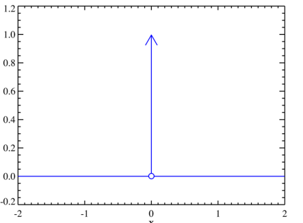

# Analýza signálů I

## Signál
- **Definice:** Prostředek přenosu informace.
- **Typy:**

### Deterministický signál
- Hodnotu lze určit v jakýkoliv čas s absolutní jistotou.

### Periodický signál
- Hodnoty se opakují v určitých konstantních intervalech.

### Harmonický signál
- Popisuje se goniometrickou funkcí sinus nebo cosinus.

### Stochastický signál
- Hodnota vzorku (realizace) v libovolném okamžiku lze určit pouze s nějakou pravděpodobností.

### Stacionární signál
- Statistické vlastnosti se nemění s časem.

### Nestacionární signál
- Statistické vlastnosti se mění s časem. 

Hranice mezi nestacionárními a stacionárními signály je nutno určovat s přihlédnutím ke zkoumané délce signálu

## Spojitý vs. diskrétní signál

- **Spojitý signál:** :
    - spojitý v čase, je závislí na spojité proměnné
    - spojitý v amplitudě, nabývá spojitých hodnot
- **Diskrétní signál:**:
    - diskrétní v čase, závisí na diskrétní proměnné (lze zapisovat jako posloupnost)
    - diskrétní v amplitudě, vzorky nabývají diskrétních hodnot

## Typické signály
- Jednotkový skok   

- Jednotkový impuls (Diracova delta)  

## Biologické signály
- **Vlastní (generované):** Např. teplota, elektrická aktivita svalů, srdce.
- **Zprostředkované (modulované):** Např. ultrazvuk, RTG záření, odraz viditelného světla.

## Zpracování signálu
- **Vzorkování a kvantování:**   
Spojitý signál se převádí na digitální diskrétní signál pomocí procesu **vzorkování**, kde se signál měří v pravidelných časových intervalech (takže máme signál jenom v určitých časech), a **kvantování**, kdy se amplituda každého vzorku zaokrouhluje na nejbližší hodnotu z předdefinované sady možností (takže máme jenom určité hodnoty například 0-255).  

**Nyquistův teorém**:
říká, že pro správné vzorkování spojitého signálu musí být vzorkovací frekvence alespoň dvojnásobek nejvyšší frekvence v signálu.   
**Aliasing** nastává, když je vzorkovací frekvence příliš nízká a vyšší frekvence signálu se nesprávně "překládají" na nižší frekvence. Pro zamezení aliasingu je tedy klíčové dodržet Nyquistův teorém.

## Lineární systémy
Lineární systém v oblasti analýzy signálů je matematický model, který popisuje vztah mezi vstupním a výstupním signálem, základní vlastnosti: 
- **Aditiva**: znamená, že když na vstupu sčítáte dva signály, výstup systému bude součtem odpovědí na tyto jednotlivé signály.
- **Homogenita**: znamená, že pokud zvýším amplitudu vstupního signálu o nějaký faktor výstup signálu se zvýší o stejný faktor.

## Časově invariantní systém
- Systém nemění své chování v čase.
- Jeho výstup závisí pouze na vstupu, ne na čase.

## Lineární časově invariantní systémy (LTI)
Systém, který je jak lineární, tak časově invariantní, je známý jako LTI systém. Vlastnosti LTI systému umožňují použití některých velmi užitečných nástrojů pro analýzu, jako jsou metody založené na Fourierově transformaci a konvoluci.

## Konvoluce
Konvoluce je matematický proces, který kombinuje dva signály do jednoho nového signálu, zaznamenávající, jak jeden signál ovlivňuje druhý. 

## Korelace
- Určuje vzájemnou podobnost mezi signály.
- **Autokorelace:** Určuje, zda se signál neopakuje.

## Převzorkování
- Změna vzorkovací frekvence signálu.
  - **Decimace:** Snížení vzorkovací frekvence.
  - **Interpolace:** Zvýšení vzorkovací frekvence.

### Decimace
- Aliasing je potenciální problém.
- Výběr \(r\)-tého vzorku z původního signálu.

### Interpolace
- Metody:
  - **Zero interpolation:** Doplnění nulami mezi vzorky.
  - **Step interpolation:** Doplnění předchozí známou hodnotou.
  - **Lineární interpolace:** Doplnění lineární funkcí procházející okolními vzorky.

