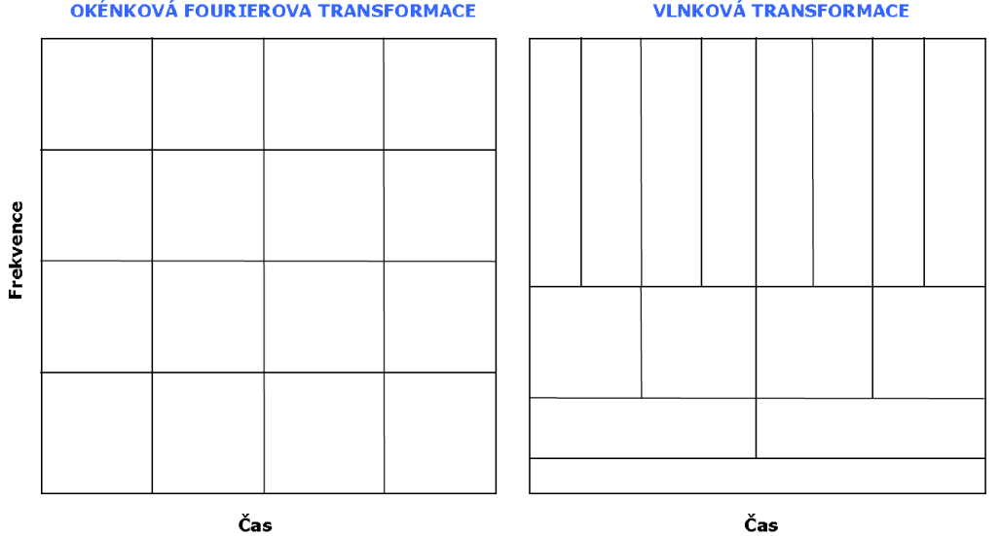

# Vlnková transformace

## Signál v časové doméně
- Signál měřený v čase
    - Amplituda je závislá veličina funkce času
- Přirozená reprezentace měřené veličiny
    - Většina měření probíhá primárně v čase
- Ne vždy vhodná doména pro analýzu signálu
    - Nemá v časové oblasti jasně patrnou informaci
    - Je rušený a rušení je více patrné v jiné doméně
    - Vhodná extrakce příznaků v jiné doméně

**Typický příklad**:
- EKG - signál mající diagnostický význam v časové oblasti
- EEG - signál mající diagnostický význam ve frekvenční oblasti

## Signál ve frekvenční doméně
- Základní metoda je Fourierova transformace
- Převod z čistě časové oblasti do čistě frekvenční oblasti
- Rozložení na frekvenční složky reprezentované bází (sin, cos)
- Signál ve frekvenční oblasti je komplexní signál
    - Rozklad probíhá z 1D do 2D prostoru (frekvence, reálná, imaginární složka) – my však zobrazujeme mod – tedy opět 1D signál

U signálu který se nemění v čase **stacionární** nevadí že přijdeme o časovou složku ale u **nestacionárního** nebo-li toho co se mění v čase a to může být problematické

## Časově-frekvenční oblast
- Short-time Fourier Transform (STFT) (Okénková Fourierova transformace)
    - Metoda založená na Fourierově transformaci a rozdělení signálu v časové oblasti
    - Násobení signálu posuvným oknem
    - Výstup ve třech dimenzích – frekvence, čas, amplituda
    - Amplituda je funkcí frekvence a času
    - Délka okna určuje přesnost transformace v časové a/i frekvenční oblasti

Nejčastější zobrazení pomocí spektrogramu.  

Nevýhodou STFT je konstantní velikost délky segmentů signálu v časové oblasti

### Otázka jak volit šířku okna
- Pomalejší frekvence menšíš rozlišení v čase vyšší ve frekvencích
- Rychlejší frekvence je vhodné rozlišovat v kratším čase

Široké okno má tedy dobré rozlišení ve frekvenční doméně   
Úzké okno má dobré rozlišení v čase

**Problém je analogií Heisenbergova principu neurčitosti**
- Nelze současně stejně přesně určit polohu a rychlost částice

## Vlnková transformace
- Přidává nekonstantní šířku okna, kterým je násoben užitečný signál
    - Stále platí princip neurčitosti, ale změnou šířky okna můžeme jeho efekt snížit – zpřesnit výsledek transformace
    - Využívá vlastnosti, že rychlé frekvence trvají obvykle kratší čas, kdežto pomalé frekvence delší čas
- U STFT se provádí Fourierova transformace, zde je transformace celková, bez následné FT

- Založená na bazi vlnek
    - Krátké funkce, které tvoří okno pro přenásobení signálu
    - Různé vlnky mají různé vlastnosti - vhodné pro různé signály
    - obecně založena na schopnosti dekompozice signálu pomocí rozvojových koeficientů

**Typy vlnek**: Haar, sinc, Gausian, Mexican Hat

## Spojitá vlnková transformace
- CWT
- Založena na míře podobnosti vybrané vlnky v různých měřítcích s užitečným signálem
- Vlnka se posouvá vůči signálu v čase
- Vlnka mění své měřítko, které je nepřímo úměrné frekvenci 
- Vzniká množina signálů
    - Pro každé měřítko vlnky jeden podobností signál vlnky a užitečného signálu
- Signály jsou v digitální podobě reprezentovány vzorky

**Scalogram** - grafický výstup spojité vlnkové transformace

### Multirozklad
Základem vlnkové transformace je schopnost rozkládat signál na více úrovní, kde každá úroveň odpovídá určitému rozsahu frekvencí a detailů v signálu. Tento rozklad umožňuje analyzovat signál na různých úrovních detailů.  

**Vlnková funkce (wavelet, mateřská vlnka)** - Toto je základní funkce, která se používá k analýze signálu. Vlnková funkce je v podstatě malý vlnový úsek, který se může škálovat (změna velikosti) a posunovat. Pomocí této funkce lze rozkládat signál na detailní komponenty na různých měřítkách.  

**Měřítková (scaling) funkce** - Měřítková funkce je další klíčový prvek, který pomáhá pokrývat celé spektrum frekvencí signálu. Zatímco vlnková funkce se zaměřuje na detaily (vyšší frekvence), měřítková funkce se zaměřuje na aproximace, tedy na nižší frekvence a základní trendy v signálu.

**Váhovaná sumarizace** - Princip spočívá v tom, že signál lze reprezentovat pomocí sumarizace (sčítání) funkcí, které jsou posunuté (shifted) a škálované verze měřítkové funkce. Škálováním měřítkové funkce můžeme reprezentovat signál na různých úrovních detailu.

**Aproximace a detaily** - Výsledný rozklad signálu pomocí vlnkové transformace produkuje dva typy komponent: aproximace a detaily. Aproximace obsahují informace o hlavních trendech signálu na dané úrovni (nižší frekvence), zatímco detaily obsahují informace o rychlých změnách (vyšší frekvence).

## Diskrétní vlnková transformace
- Discrete wavelet transform (DWT)
    - Optimalizace diskretizované CWT
    - Optimalizované vzorkování frekvenčního prostoru
    - Dyadická (dvojková) mřížka daná předpisem
    - Lze najít bázi vlnek, které jsou ortogonální / ortonormální

## Využití DWT
- Filtrace signálu
- Využití N-té aproximace (nižší frekvence signálu)
- Odstranění dané aproximace (aproximací) ze signálu

- Časové frekvenční vzorkování
    - Výsledný prostor (plocha) je stejný, ale jinak rozdělený
    - 

**Diskrétní vlnková transformace (DWT)** je technika zpracování signálů, která umožňuje rozdělení signálu na frekvenční komponenty a analýzu signálu na různých úrovních detailu. Tato metoda je založena na principu rozkladu signálu pomocí dvou základních funkcí: scaling funkce a vlnkové funkce.

**Scaling funkce**: Interakce signálu se scaling funkcí vede k vytvoření komponenty nazývané aproximace. Aproximace obsahuje informace o nižších frekvencích signálu a reprezentuje jeho hlavní charakteristiky.

**Vlnková funkce**: Interakce signálu s vlnkovou funkcí produkuje komponentu nazývanou detail. Detaily obsahují vyšší frekvenční obsah a umožňují zachytit rychlé změny v signálu.

**Pyramidový algoritmus:** Tento algoritmus, často nazývaný také Mallatův algoritmus, zahrnuje postupné filtrování signálu pomocí dolních a horních propustí. Po každém filtrování je signál podvzorkován, což snižuje frekvenci vzorkování signálu na polovinu a umožňuje dále analyzovat frekvenční pásma.

### Využití DWT:
- **Filtrace signálu:** DWT umožňuje vyhlazení signálu odstraněním vyšších frekvenčních komponent (detailů) nebo použitím nízkých frekvencí (aproximací) pro zachování základní struktury signálu.
- **Detekce změn v signálu:** Díky schopnosti rozdělit signál na detaily a aproximace, DWT pomáhá identifikovat specifické změny a charakteristiky v signálu, jako jsou náhlé skoky nebo trendové změny.

### Rozložení a vztah mezi aproximacemi a detaily:
DWT poskytuje hierarchický pohled na signál, kde každá další úroveň rozkladu nabízí detailnější pohled na frekvenční obsah signálu. To je užitečné pro různé aplikace, včetně analýzy biomedicínských signálů, zvukového zpracování a geofyzikálního průzkumu.

## Vlnková transformace v Matlabu
- Příkazy v Matlabu jsou rozděleny pro spojitou a diskrétní transformaci
- Základním příkazem pro spojitou vlnkovou transformaci je cwt
- Inverzní vlnková transformace je icwt
- Existuje příkaz pro vytvoření banky filtrů i pro cwt – cwtfilterbank
- Diskrétní transformace má příkaz dwt a idwt pro inverzní transformaci
- Pro informace o vlnkách je příkaz waveinfo
- V rámci GUI má Matlab příkaz waveletAnalyzer
